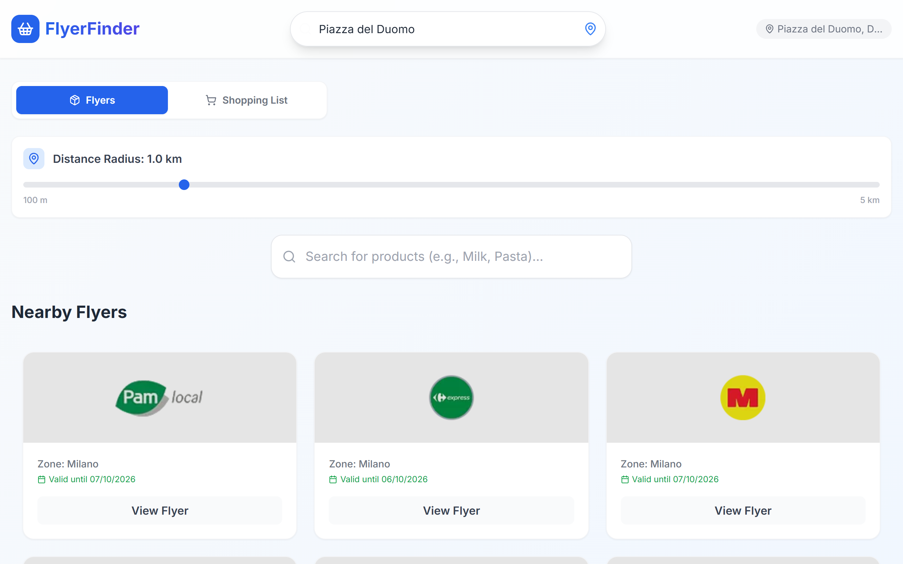
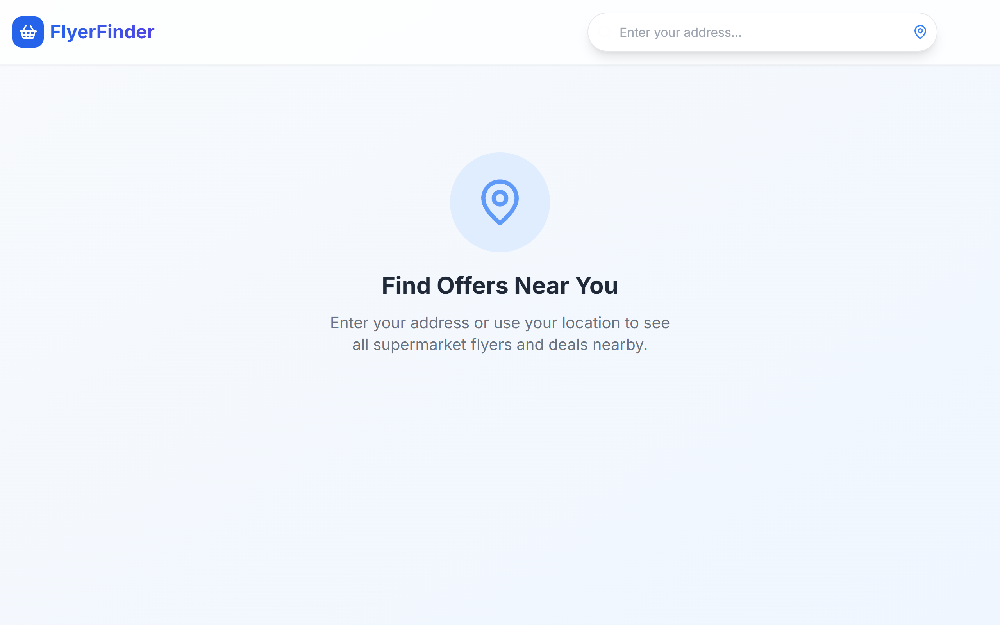
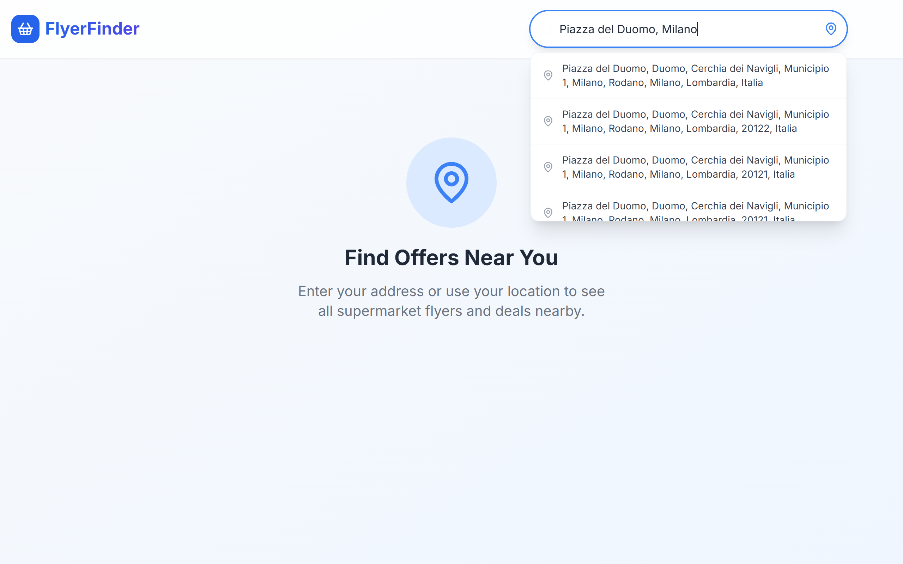
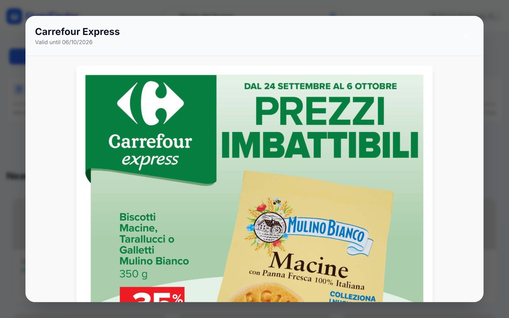
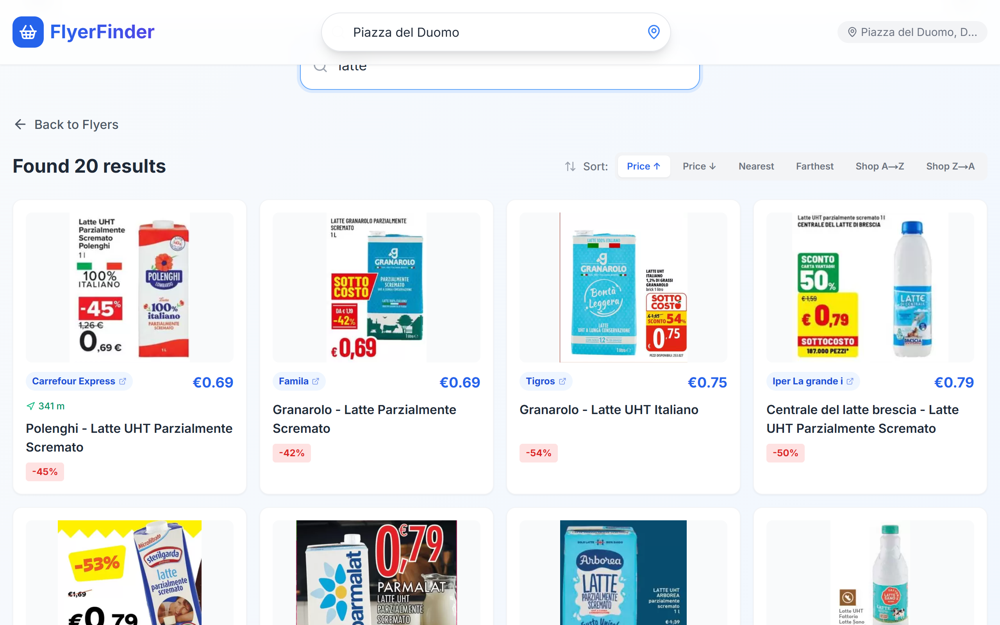
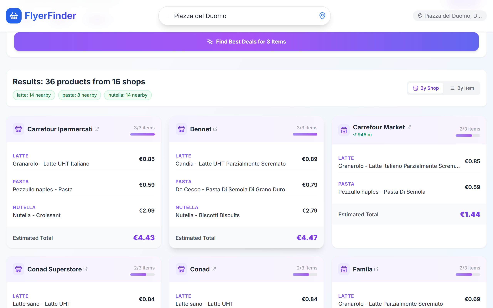

# FlyerFinder

Find supermarket flyers and grocery deals near any address in Italy, search for a product across nearby shops, and compare a whole shopping list to see where it costs least.

Data comes from [PromoQui](https://www.promoqui.it), read by the scripts in [`scripts/`](scripts).



## Features

- **Location search**: type an address (geocoded with OpenStreetMap Nominatim) or use the browser's location.
- **Nearby flyers**: grocery flyers around that position, filterable by distance (100 m – 5 km).
- **Flyer viewer**: open any flyer and scroll through its pages.
- **Product search**: current offers for a product near you, with price and discount.
- **Shopping list**: search every item at once and compare shops by estimated total, or compare items one by one.

## Screenshots

| | |
|---|---|
|  |  |
|  |  |



## Getting started

Requires Node.js 18 or later.

```bash
npm install
npm run dev
```

Open [http://localhost:3000](http://localhost:3000).

## How it works

The Next.js API routes in [`app/api`](app/api) run the scripts in [`scripts/`](scripts):

| Script | Used by | What it does |
|---|---|---|
| `scraper_flyers.js` | `/api/supermarkets` | Lists grocery flyers near a position through PromoQui's flyer listing |
| `scraper.js` | `/api/products/search`, `/api/products/shopping-list` | Reads product offers near a position from PromoQui's offer and search pages |
| `scraper_flyer_details.js` | `/api/flyers/[id]` | Resolves a flyer's page images from its publication |
| `promoqui.js` | all of the above | Shared helpers: opening the site at a position, reading page data |

The scrapers depend on how promoqui.it is built, so they may need updating when the site changes.
